# Cloud Native Project - Cloud Application Development – Winter Term 2025/26
## Team Bermuda Dreieck

**Team Members:** Leo Tschritter, Dennis Hoang, Benedikt Scheffel

**Date:** January 27, 2026

---

## Table of Contents
1. [Requirements](#1-requirements)
   - 1.1 [System Context](#11-system-context)
   - 1.2 [Feature Overview](#12-feature-overview)
   - 1.3 [Domain Model](#13-domain-model)
2. [Runtime View](#2-runtime-view)
   - 2.1 [Runtime Overview](#21-runtime-overview)
   - 2.2 [Microservices](#22-microservices)
   - 2.3 [Datastores](#23-datastores)
   - 2.4 [Security: Roles and Role Mapping](#24-security-roles-and-role-mapping)
3. [Development View](#3-development-view)
   - 3.1 [Software Components](#31-software-components)
4. [DevOps](#4-devops)
   - 4.1 [Environments and Initial Infrastructure Setup](#41-environments-and-initial-infrastructure-setup)
   - 4.2 [Pipelines and Release of new Features](#42-pipelines-and-release-of-new-features)
   - 4.3 [Creation of new Tenants](#43-creation-of-new-tenants)
   - 4.4 [Monitoring](#44-monitoring)
5. [Performance Tests](#5-performance-tests)
   - 5.1 [Periodic Workload](#51-periodic-workload)
   - 5.2 [Once-in-a-lifetime Workload](#52-once-in-a-lifetime-workload)
6. [Commercial Model](#6-commercial-model)
   - 6.1 [Tenant Types](#61-tenant-types)
   - 6.2 [Pricing Model](#62-pricing-model)
   - 6.3 [Cost Model](#63-cost-model)

---

## 1 Requirements

### Introduction

**Tripico** is a cloud-native, multi-tenant travel planning application that enables users to create, share, and discover travel itineraries. The system provides comprehensive travel planning features including itinerary management, personalized recommendations, real-time weather forecasts, travel warnings, and social interactions through comments and likes.

The application is built as a microservices architecture deployed on Google Cloud Platform (GCP), utilizing GKE Autopilot for orchestration, Firestore for document storage, Neo4j for graph-based recommendations, and Google Identity Platform for multi-tenant user authentication.

**Multi-Tenancy Model:**

Tripico implements a three-tier multi-tenancy architecture to serve different customer segments:

| Tier | Model | Target Customer |
|------|-------|-----------------|
| **Freemium** | Shared cluster, shared namespace, no tenant ID | Individual users, trial accounts |
| **Standard** | Shared cluster, dedicated namespace, dedicated tenant ID | Small-medium businesses |
| **Enterprise** | Dedicated cluster, full isolation, dedicated tenant ID | Large organizations |

**Environments:**
- **Production Environment:** Multi-tenant deployment accessible at https://frontend-freemium.tripico.fun
- **Development Environment:** Mirror environment for testing at https://dev.frontend-freemium.tripico.fun

### 1.1 System Context

The Tripico system consists of six core microservices that work together to provide travel planning functionality:

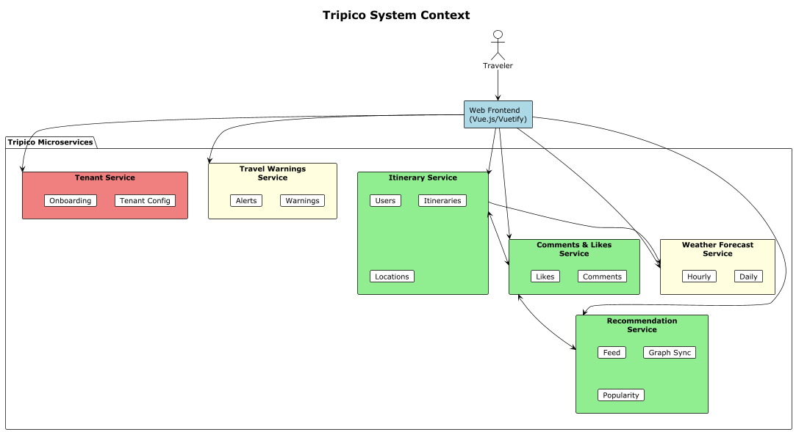

#### Microservices Overview

| Service | Responsibility | Key Endpoints |
|---------|---------------|---------------|
| **Itinerary Service** | Core service managing users, itineraries, locations, accommodations, and transport | `/api/users`, `/api/itineraries`, `/api/locations` |
| **Comments & Likes Service** | Social interactions on itineraries | `/api/comments`, `/api/likes` |
| **Recommendation Service** | Personalized recommendations using graph-based collaborative filtering | `/api/feed`, `/api/graph` |
| **Weather Forecast Service** | Weather data for travel destinations | `/api/weather/daily`, `/api/weather/hourly` |
| **Travel Warnings Service** | Travel safety information and email alerts | `/api/warnings`, `/api/trips` |
| **Tenant Service** | Multi-tenancy management, tenant configuration and onboarding | `/api/v1/tenants` |

#### Service Communication

- **Itinerary Service** is the core service that manages user and trip data
- **Comments & Likes Service** references itineraries to attach social interactions
- **Recommendation Service** syncs data from Itinerary and Comments services to build the recommendation graph
- **Weather Forecast Service** provides weather data for locations in itineraries
- **Travel Warnings Service** monitors trips and sends alerts when warnings affect destinations
- **Tenant Service** provides tenant configuration to all services and handles tenant onboarding

#### Neighboring Systems

| System | Used By | Purpose |
|--------|---------|---------|
| **Auswärtiges Amt API** | Travel Warnings Service | German Federal Foreign Office API providing real-time travel warnings |
| **Meteosource API** | Weather Forecast Service | External weather data provider for forecasts |
| **Google Identity Platform** | All Services | Multi-tenant authentication and user management |
| **SMTP Server** | Travel Warnings Service | Email delivery for travel alert notifications |

#### Actors

| Actor | Description |
|-------|-------------|
| **Traveler** | End user who creates itineraries, browses recommendations, and interacts with content |

#### User Interfaces

- **Web Frontend** - Vue.js/Vuetify-based single-page application (https://frontend-freemium.tripico.fun)
- **REST APIs** - OpenAPI-documented endpoints for all microservices

### 1.2 Feature Overview

#### Core Features (All Tiers)

**1. Itinerary Management**
- Create and read travel itineraries
- Add locations, accommodations, and transport details to trips
- Search and filter itineraries by various criteria

**2. Personalized Recommendations (Graph-based)**
- Recommendation feed using Neo4j graph database
- Collaborative filtering: "Users who liked what you liked also liked..."
- Location-based recommendations based on visited destinations
- Social signals integration (popularity based on likes count)

**3. Travel Warnings & Alerts**
- Real-time travel warning information from Auswartiges Amt
- Automated notification system for trips affected by new warnings
- Email alerts with severity levels (None, Minor, Moderate, Severe, Critical)

**4. Weather Forecasts**
- 7-day daily weather forecasts for travel destinations
- 24-hour hourly forecasts with detailed metrics
- Temperature, precipitation, wind, humidity, and UV index

**5. Social Interactions**
- Like and unlike itineraries
- Comment on itineraries with threaded discussions
- View likes count and engagement metrics

#### Tier-Specific Infrastructure

All tiers provide the **same application features** (itinerary planning, recommendations, weather forecasts, travel warnings, social interactions). The differences between tiers are purely **infrastructure and deployment related**:

| Aspect | Freemium | Standard | Enterprise                       |
|--------|----------|----------|----------------------------------|
| Namespace | Shared (`freemium`) | Dedicated (`standard-{N}`) | Dedicated cluster                |
| Subdomain | `frontend-freemium.tripico.fun` | `frontend-standard-{N}.tripico.fun` | `frontend.{company}.tripico.fun` |
| Resource Limits | Limited | Higher | Custom allocation                |
| Weather/Warnings Services | Shared | Shared | Dedicated instances              |
| Identity Tenant | Shared | Dedicated (`std-{name}`) | Dedicated (`ent-{name}`)         |
| VPC/Firewall | Shared | Shared | Private rules                    |

### 1.3 Domain Model

The Tripico platform is organized into six bounded contexts, each representing a distinct business capability with its own domain logic and data ownership:

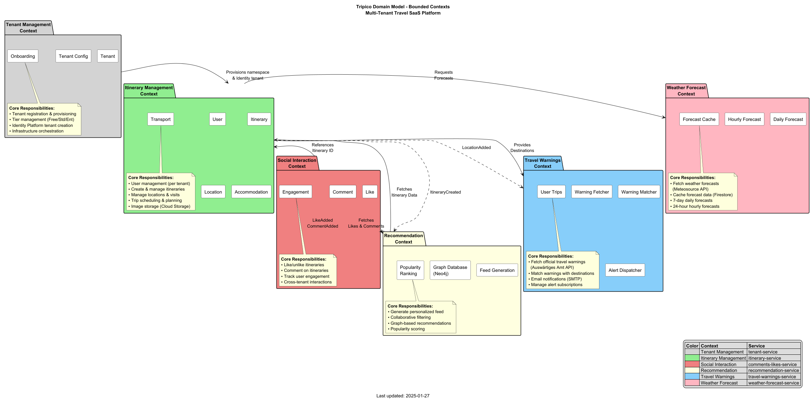

**PlantUML Source:** [diagrams/domain-model.puml](diagrams/domain-model.puml)

#### Bounded Contexts

**Tenant Management Context** *(tenant-service)*
Handles multi-tenant provisioning and lifecycle management. Responsible for tenant registration, tier management (Freemium/Standard/Enterprise), Google Identity Platform tenant creation, and infrastructure orchestration via Terraform.

**Itinerary Management Context** *(itinerary-service)*
Core business domain for travel planning. Manages users, itineraries, locations, accommodations, and transport details. Owns the PostgreSQL database for relational data and integrates with Cloud Storage for location images.

**Social Interaction Context** *(comments-likes-service)*
Enables community engagement through likes and comments on itineraries. Stores social data in Firestore with tenant-prefixed collections. Supports cross-tenant interactions for public itineraries.

**Recommendation Context** *(recommendation-service)*
Generates personalized travel recommendations using a Neo4j graph database. Implements collaborative filtering ("users who liked X also liked Y") and popularity-based ranking. Consumes events from Social and Itinerary contexts.

**Travel Warnings Context** *(travel-warnings-service)*
Fetches official travel warnings from the Auswärtiges Amt API and matches them against user trip destinations. Dispatches email notifications via SMTP when warnings affect planned trips.

**Weather Forecast Context** *(weather-forecast-service)*
Provides weather information for travel destinations. Fetches 7-day daily and 24-hour hourly forecasts from the Meteosource API. Caches forecast data in Firestore to reduce API calls.

#### Context Relationships

| Source Context | Target Context | Relationship |
|----------------|----------------|--------------|
| Tenant Management | Itinerary Management | Provisions namespace & Identity tenant |
| Social Interaction | Itinerary Management | References Itinerary ID for likes/comments |
| Recommendation | Social Interaction | Fetches likes and comments for ranking |
| Recommendation | Itinerary Management | Fetches itinerary data for feed |
| Itinerary Management | Travel Warnings | Provides destinations for warning matching |
| Itinerary Management | Weather Forecast | Requests forecasts for locations |

For detailed data models and entity attributes, see [Section 2.3 Datastores](#23-datastores).

---

## 2 Runtime View

### 2.1 Runtime Overview

#### Multi-Tenant Cloud Architecture

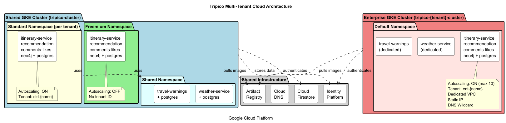
**PlantUML Source:** [diagrams/multi-tenant-architecture.puml](diagrams/multi-tenant-architecture.puml)

#### Cloud Resources

**Google Cloud Platform (GCP)**

Tripico operates with a multi-tenant architecture across GCP:

| Resource | Freemium                 | Standard | Enterprise |
|----------|--------------------------|----------|------------|
| **GKE Cluster** | Shared (tripico-cluster) | Shared (tripico-cluster) | Dedicated (tripico-{tenant}-cluster) |
| **Kubernetes Namespace** | freemium                 | {tenant-name} | default |
| **VPC Network** | Shared (tripico-network) | Shared | Dedicated (tripico-{tenant}-network) |
| **Static IP** | Shared                   | Shared | Dedicated |
| **DNS Records** | Shared wildcard          | Shared wildcard | Dedicated wildcard (*.{tenant}.tripico.fun) |
| **Identity Platform** | Project-level auth       | Dedicated tenant (std-{name}) | Dedicated tenant (ent-{name}) |
| **Storage Bucket** | Dedicated                | Dedicated | Dedicated |
| **API Gateway** | Dedicated                | Dedicated | Dedicated |

**Running Application URLs:**

**Production:**
- Frontend: https://frontend-freemium.tripico.fun
- Freemium APIs: https://itinerary-freemium.tripico.fun
- Standard APIs: https://itinerary-{tenant}.tripico.fun
- Enterprise APIs: https://itinerary.{tenant}.tripico.fun

**Development:**
- Frontend: https://dev.frontend-freemium.tripico.fun
- Freemium APIs: https://itinerary-freemium.dev.tripico.fun

#### Service Communication

**Synchronous Services:**
- All microservices expose REST APIs with tenant context headers
- Frontend communicates with backend via REST APIs with tenant ID in headers/config
- Backend services validate tenant context from JWT tokens

**Asynchronous Services:**
- Travel Warnings Service uses scheduled jobs (every 15 minutes)
- Weather Service uses scheduled jobs for daily forecast updates
- Email notifications sent asynchronously via Quarkus Mailer

### 2.2 Microservices

#### 2.2.1 Itinerary Service

**Description:**
Core backend service managing user accounts and travel itineraries with tenant-aware data isolation.

**Runtime Configuration:**
- **Container Image:** `europe-west1-docker.pkg.dev/{project}/docker-repo/itinerary-service`
- **Deployment:** Kubernetes Deployment per namespace
- **Resource Limits:**
  ```yaml
  # Freemium
  resources:
    requests: { memory: "512Mi", cpu: "250m" }
    limits: { memory: "1Gi", cpu: "500m" }

  # Standard/Enterprise
  resources:
    requests: { memory: "512Mi", cpu: "250m" }
    limits: { memory: "1Gi", cpu: "1000m" }
  ```

**Scalability:**

| Tier       | Min Replicas | Max Replicas | Auto-scaling   |
|------------|--------------|--------------|----------------|
| Freemium   | 1            | 1            | OFF            |
| Standard   | 1            | 2            | ON (CPU 70%)   |
| Enterprise | 2            | 10           | ON (CPU 70%)   |

**Multi-Tenancy Isolation:**
- **Data Isolation:** Tenant ID stored in JWT, validated on every request
- **Firestore Collections:** Prefixed with tenant ID for Standard/Enterprise
- **Database:** Separate PostgreSQL instance per namespace
- **User Scoping:** Users can only access resources within their tenant

**Security:**
- Firebase/Identity Platform JWT token validation with tenant verification
- Tenant ID extracted from token claims (`firebase.tenant`)
- Workload Identity for GCP service access

**External Connections:**
- PostgreSQL (in-cluster deployment)
- Google Identity Platform for authentication
- Recommendation Service for graph sync

---

#### 2.2.2 Recommendation Service

**Description:**
Graph-based recommendation engine using Neo4j with tenant-aware graph partitioning.

**Runtime Configuration:**
- **Deployment:** Kubernetes Deployment + StatefulSet for Neo4j
- **Resource Limits:**
  ```yaml
  # Neo4j
  resources:
    requests: { memory: "1Gi", cpu: "500m" }
    limits: { memory: "2Gi", cpu: "2000m" }
  ```

**Multi-Tenancy Isolation:**
- **Graph Partitioning:** Each tenant's data stored with tenant prefix on node properties
- **Query Isolation:** All Cypher queries filtered by tenant ID
- **Namespace Separation:** Separate Neo4j instance per namespace

**Graph Query with Tenant Filter:**
```cypher
// Recommendations filtered by tenant
MATCH (user:User {userId: $userId, tenantId: $tenantId})
      -[:LIKES]->(itinerary:Itinerary {tenantId: $tenantId})
      <-[:LIKES]-(similarUser:User {tenantId: $tenantId})
MATCH (similarUser)-[:LIKES]->(recommendation:Itinerary {tenantId: $tenantId})
WHERE NOT (user)-[:LIKES]->(recommendation)
RETURN recommendation
ORDER BY recommendation.likesCount DESC
```

---

#### 2.2.3 Comments & Likes Service

**Description:**
Handles social interactions on itineraries using Firestore with tenant-aware collections.

**Multi-Tenancy Isolation:**
- **Collection Structure:**
  ```
  # Freemium (no tenant prefix)
  /comments/{commentId}
  /likes/{likeId}

  # Standard/Enterprise (tenant-prefixed)
  /tenants/{tenantId}/comments/{commentId}
  /tenants/{tenantId}/likes/{likeId}
  ```
- **Security Rules:** Firestore security rules enforce tenant isolation
- **Query Filtering:** All queries include tenant ID filter

---

#### 2.2.4 Travel Warnings Service (Shared)

**Description:**
Fetches travel advisories from Auswartiges Amt API. Deployed in shared namespace for Freemium/Standard, dedicated for Enterprise.

**Multi-Tenancy:**
- **Freemium/Standard:** Shared service in `shared` namespace
- **Enterprise:** Dedicated instance in enterprise cluster

---

#### 2.2.5 Weather Forecast Service (Shared)

**Description:**
Integrates with Meteosource API for weather forecasts. Shared across Freemium/Standard tiers.

**Multi-Tenancy:**
- **Freemium/Standard:** Shared service in `shared` namespace
- **Enterprise:** Dedicated instance in enterprise cluster

---

### 2.3 Datastores

#### Storage Overview with Tenant Isolation

| Datastore | Technology | Freemium | Standard | Enterprise |
|-----------|------------|----------|----------|------------|
| **Tenant Registry** | MongoDB | N/A | Central registry | Central registry |
| **Itinerary DB** | PostgreSQL | Shared instance | Namespace-isolated | Cluster-isolated |
| **Comments/Likes** | Firestore | Shared collections | Tenant-prefixed collections | Tenant-prefixed collections |
| **Recommendations** | Neo4j | Shared graph | Namespace-isolated | Cluster-isolated |
| **Weather/Warnings** | PostgreSQL | Shared | Shared | Dedicated |

#### Complete Data Model Overview

The following diagram shows the complete data model across all microservices and their datastores:

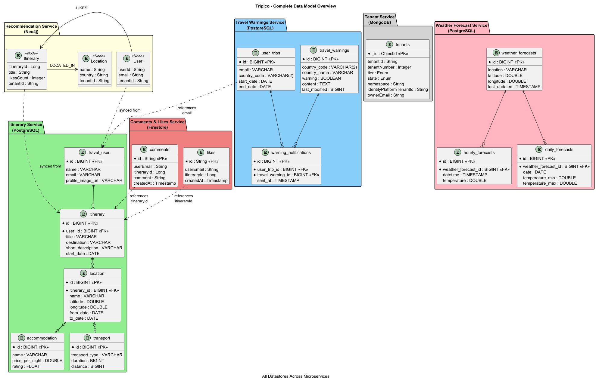

**PlantUML Source:** [diagrams/er-complete-overview.puml](diagrams/er-complete-overview.puml)

**Cross-Service Data References:**
- Comments & Likes reference `itineraryId` from Itinerary Service
- Recommendation Service syncs User and Itinerary data from Itinerary Service
- Travel Warnings matches user trips by `email` from Itinerary Service users

---

#### 2.3.1 Itinerary Service Database (PostgreSQL)

**ER Diagram:**

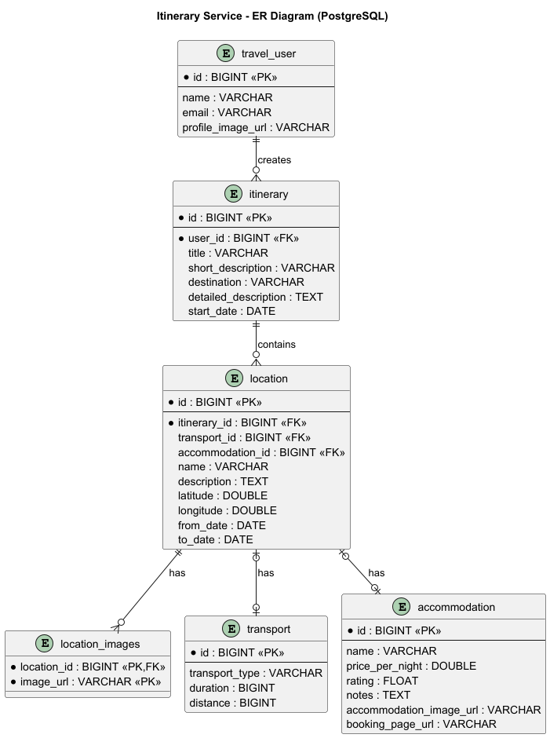

**PlantUML Source:** [diagrams/er-itinerary-service.puml](diagrams/er-itinerary-service.puml)

**Tables:**

| Table | Description |
|-------|-------------|
| `travel_user` | User accounts (synced from Identity Platform) |
| `itinerary` | Travel itineraries with metadata |
| `location` | Destinations within an itinerary |
| `location_images` | Image URLs for locations (Cloud Storage) |
| `transport` | Transport details between locations |
| `accommodation` | Accommodation bookings per location |

**Tenant Isolation:**
- **Freemium:** Shared PostgreSQL instance, users distinguished by `email`
- **Standard:** Separate PostgreSQL deployment per namespace
- **Enterprise:** Dedicated PostgreSQL in isolated cluster

---

#### 2.3.2 Comments & Likes Service (Firestore)

**Collection Structure Diagram:**

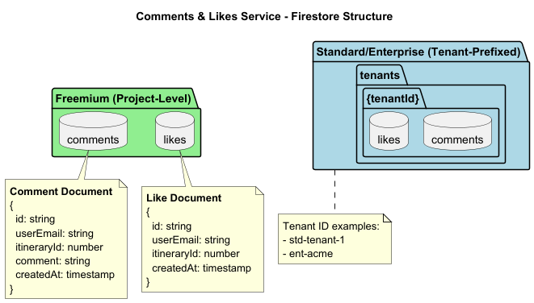

**PlantUML Source:** [diagrams/firestore-comments-likes.puml](diagrams/firestore-comments-likes.puml)

**Collection Paths:**

| Tier | Comments Path | Likes Path |
|------|---------------|------------|
| Freemium | `/comments/{commentId}` | `/likes/{likeId}` |
| Standard/Enterprise | `/tenants/{tenantId}/comments/{commentId}` | `/tenants/{tenantId}/likes/{likeId}` |

**Comment Document Schema:**

```json
{
  "id": "comment-abc123",
  "userEmail": "user@example.com",
  "itineraryId": 456,
  "comment": "Great trip recommendation!",
  "createdAt": "2026-01-15T10:30:00Z"
}
```

**Like Document Schema:**

```json
{
  "id": "like-xyz789",
  "userEmail": "user@example.com",
  "itineraryId": 456,
  "createdAt": "2026-01-15T10:30:00Z"
}
```

---

#### 2.3.3 Recommendation Service (Neo4j)

**Graph Model Diagram:**

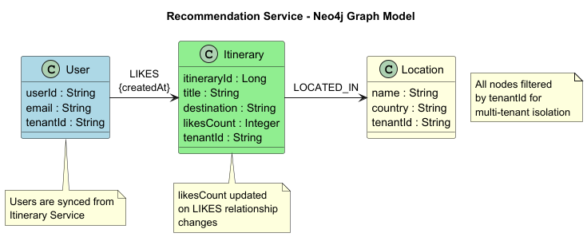

**PlantUML Source:** [diagrams/neo4j-recommendation.puml](diagrams/neo4j-recommendation.puml)

**Node Types:**

| Node | Properties |
|------|------------|
| `User` | userId, email, tenantId |
| `Itinerary` | itineraryId, title, destination, likesCount, tenantId |
| `Location` | name, country, tenantId |

**Relationships:**

| Relationship | Description |
|--------------|-------------|
| `LIKES` | User liked an itinerary (with createdAt timestamp) |
| `LOCATED_IN` | Itinerary has locations in countries |

**Tenant Isolation:** All Cypher queries filter by `tenantId` property on nodes.

---

#### 2.3.4 Travel Warnings Service (PostgreSQL)

**ER Diagram:**

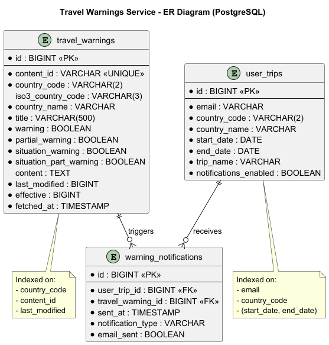

**PlantUML Source:** [diagrams/er-travel-warnings.puml](diagrams/er-travel-warnings.puml)

**Tables:**

| Table | Description |
|-------|-------------|
| `travel_warnings` | Country warnings from Auswärtiges Amt |
| `user_trips` | User trip registrations for notifications |
| `warning_notifications` | Sent notification history |

**travel_warnings Schema:**

| Column | Type | Description |
|--------|------|-------------|
| id | BIGINT | Primary key |
| content_id | VARCHAR | Unique ID from source |
| country_code | VARCHAR(2) | ISO country code |
| country_name | VARCHAR | Full country name |
| warning | BOOLEAN | Full travel warning |
| partial_warning | BOOLEAN | Partial travel warning |
| situation_warning | BOOLEAN | Situation-based warning |
| content | TEXT | Full warning content (HTML) |
| last_modified | BIGINT | Source timestamp |
| fetched_at | TIMESTAMP | When fetched |

**user_trips Schema:**

| Column | Type | Description |
|--------|------|-------------|
| id | BIGINT | Primary key |
| email | VARCHAR | User email |
| country_code | VARCHAR(2) | Destination country |
| start_date | DATE | Trip start |
| end_date | DATE | Trip end |
| notifications_enabled | BOOLEAN | Receive alerts |

---

#### 2.3.5 Weather Forecast Service (PostgreSQL)

**ER Diagram:**

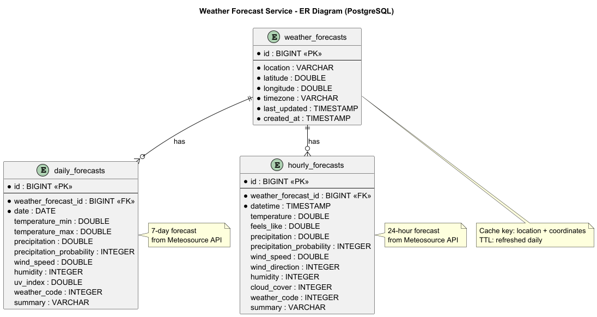

**PlantUML Source:** [diagrams/er-weather-forecast.puml](diagrams/er-weather-forecast.puml)

**Tables:**

| Table | Description |
|-------|-------------|
| `weather_forecasts` | Location forecast metadata |
| `daily_forecasts` | 7-day daily forecasts |
| `hourly_forecasts` | 24-hour hourly forecasts |

**weather_forecasts Schema:**

| Column | Type | Description |
|--------|------|-------------|
| id | BIGINT | Primary key |
| location | VARCHAR | Location name |
| latitude | DOUBLE | Coordinates |
| longitude | DOUBLE | Coordinates |
| timezone | VARCHAR | Location timezone |
| last_updated | TIMESTAMP | Cache timestamp |

**daily_forecasts Schema:**

| Column | Type | Description |
|--------|------|-------------|
| id | BIGINT | Primary key |
| weather_forecast_id | BIGINT | FK to parent |
| date | DATE | Forecast date |
| temperature_min | DOUBLE | Min temperature (°C) |
| temperature_max | DOUBLE | Max temperature (°C) |
| precipitation | DOUBLE | Precipitation (mm) |
| weather_code | INTEGER | Weather condition code |
| summary | VARCHAR | Weather description |

---

#### 2.3.6 Tenant Service (MongoDB)

**Data Model Diagram:**

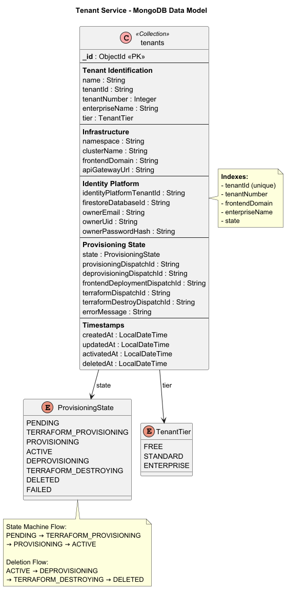

**PlantUML Source:** [diagrams/mongodb-tenant-service.puml](diagrams/mongodb-tenant-service.puml)

**Collection:** `tenants`

The Tenant Service uses MongoDB to store tenant registration and provisioning state. This is the central registry for all Standard and Enterprise tenants.

**Key Fields:**

| Field | Type | Description |
|-------|------|-------------|
| _id | ObjectId | MongoDB primary key |
| tenantId | String | Sanitized tenant identifier |
| tenantNumber | Integer | Numeric ID for Standard tier (1, 2, 3...) |
| enterpriseName | String | Company name for Enterprise tier |
| tier | Enum | FREE, STANDARD, ENTERPRISE |
| state | Enum | Provisioning lifecycle state |
| namespace | String | Kubernetes namespace name |
| clusterName | String | GKE cluster name |
| identityPlatformTenantId | String | Google Identity Platform tenant ID |
| ownerEmail | String | Tenant owner's email |
| frontendDomain | String | Frontend URL |

**Provisioning States:**

| State | Description |
|-------|-------------|
| PENDING | Initial state, awaiting provisioning |
| TERRAFORM_PROVISIONING | Terraform workflow running |
| PROVISIONING | Kubernetes deployment in progress |
| ACTIVE | Successfully provisioned |
| DEPROVISIONING | Deletion in progress |
| TERRAFORM_DESTROYING | Terraform destroy running |
| DELETED | Successfully removed |
| FAILED | Provisioning or deletion failed |

---

### 2.4 Security: Roles and Role Mapping

#### Service Accounts

**GCP Service Account:** `tripico-sa@{project-id}.iam.gserviceaccount.com`

| Role | Purpose |
|------|---------|
| `roles/datastore.user` | Firestore read/write |
| `roles/storage.objectViewer` | Cloud Storage read |
| `roles/secretmanager.secretAccessor` | Secret access |
| `roles/iam.workloadIdentityUser` | Workload Identity binding |

**Workload Identity Bindings:**

Each Kubernetes service account is bound to the GCP service account with tenant-specific bindings:

```hcl
# Freemium namespace
serviceAccount:{project}.svc.id.goog[freemium/itinerary-service-sa]

# Standard namespace
serviceAccount:{project}.svc.id.goog[{tenant-name}/itinerary-service-sa]

# Enterprise (dedicated cluster)
serviceAccount:{project}.svc.id.goog[default/itinerary-service-sa]
```

#### Identity Platform Multi-Tenancy

**Tenant Structure:**

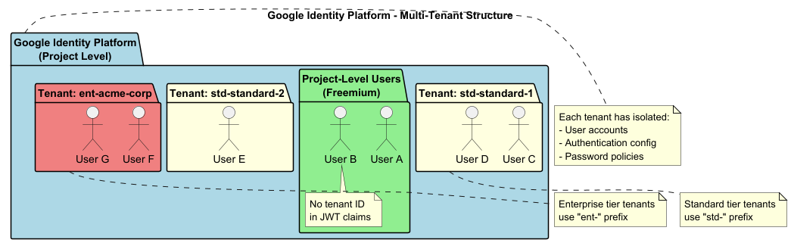

**PlantUML Source:** [diagrams/identity-platform-tenants.puml](diagrams/identity-platform-tenants.puml)

**Authentication Flow with Tenant Isolation:**

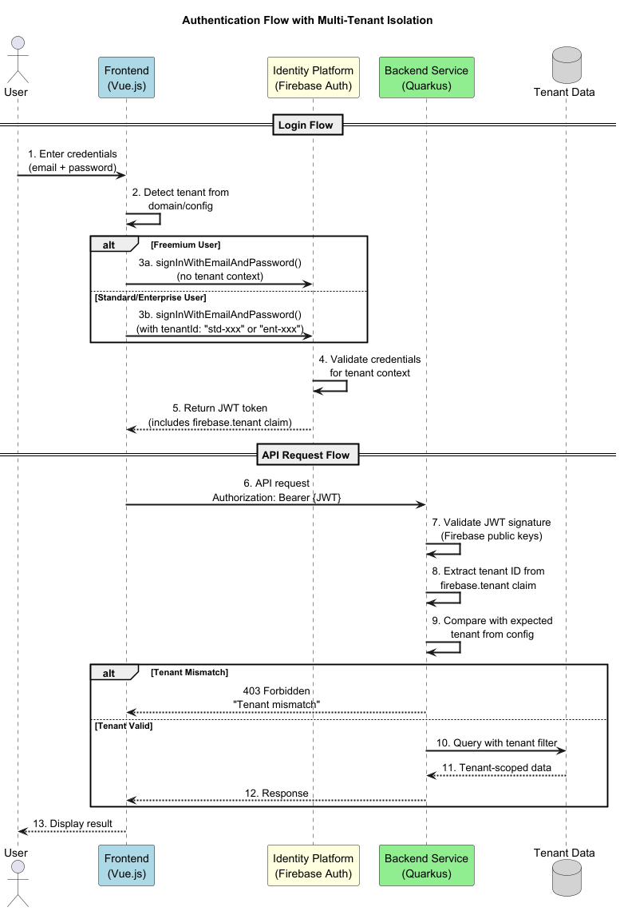

**PlantUML Source:** [diagrams/auth-flow-tenant.puml](diagrams/auth-flow-tenant.puml)

**JWT Token Claims for Multi-Tenancy:**
```json
{
  "iss": "https://securetoken.google.com/{project-id}",
  "sub": "user-uid-123",
  "firebase": {
    "tenant": "std-standard-1",
    "sign_in_provider": "password"
  },
  "email": "user@example.com"
}
```

**Backend Tenant Validation (Quarkus):**
```java
@Provider
public class TenantContextFilter implements ContainerRequestFilter {

    @Override
    public void filter(ContainerRequestContext ctx) {
        // Extract tenant from JWT
        String expectedTenant = config.getOptionalValue(
            "identity-platform.tenant.expected-id", String.class)
            .orElse(null);

        // Freemium: no tenant expected
        if (expectedTenant == null || expectedTenant.isEmpty()) {
            return; // Allow project-level auth
        }

        // Standard/Enterprise: validate tenant matches
        String tokenTenant = extractTenantFromJwt(ctx);
        if (!expectedTenant.equals(tokenTenant)) {
            throw new ForbiddenException("Tenant mismatch");
        }
    }
}
```

**Tenant Isolation Enforcement:**

| Layer | Isolation Mechanism |
|-------|---------------------|
| **Network** | Kubernetes NetworkPolicies, Enterprise VPC isolation |
| **Authentication** | Identity Platform tenant separation |
| **Authorization** | JWT tenant claim validation in every service |
| **Data** | Tenant-prefixed collections, namespace-isolated databases |
| **Compute** | Namespace isolation, Enterprise cluster isolation |

---
## 3 Development View

### 3.1 Software Components

#### Repository Organization

**Backend Monorepo:** https://github.com/leotschritter/cad-backend

```
cad-backend/
├── .github/workflows/           # CI/CD pipelines
│   ├── terraform.yml           # Infrastructure provisioning (tenant creation)
│   ├── build-and-push.yml      # Docker image builds
│   └── deploy-multi-namespace.yml  # Helm deployments per tenant
├── terraform/
│   ├── environment/
│   │   ├── free/               # Freemium tier infrastructure
│   │   ├── standard/           # Standard tier tenant template
│   │   └── enterprise/         # Enterprise tier tenant template
│   └── modules/
│       ├── api-gateway/        # API Gateway configuration
│       ├── artifact-registry/  # Container registry
│       ├── dns/                # DNS zone and records
│       ├── firestore/          # Firestore database
│       ├── gke/                # GKE Autopilot cluster
│       ├── iam/                # Service accounts and bindings
│       ├── project/            # GCP APIs and Identity Platform
│       └── storage/            # Cloud Storage buckets
├── services/
│   ├── itinerary-service/      # Core itinerary management
│   ├── recommendation-service/ # Neo4j-based recommendations
│   ├── comments-likes-service/ # Social interactions
│   ├── travel_warnings/        # Travel safety alerts
│   └── weather-forecast-service/  # Weather integration
├── load/                       # Locust load testing suite
└── docs/                       # Documentation and diagrams
```

**Frontend Repository:** https://github.com/leotschritter/cad-frontend

#### Software Components Overview

| Component | Language | Framework | Purpose |
|-----------|----------|-----------|---------|
| **Itinerary Service** | Java 21 | Quarkus 3.28.1 | Core itinerary and user management |
| **Recommendation Service** | Java 21 | Quarkus 3.x | Graph-based recommendations |
| **Comments & Likes Service** | Java 21 | Quarkus 3.x | Social interactions |
| **Travel Warnings Service** | Java 21 | Quarkus 3.29.3 | Travel safety alerts |
| **Weather Forecast Service** | Java 21 | Quarkus 3.x | Weather data integration |
| **Frontend** | TypeScript | Vue.js 3 + Vuetify | User interface |

#### Key Libraries

**Backend Services (Common):**
- Quarkus REST - RESTful web services
- Firebase Admin SDK - Multi-tenant authentication
- Hibernate ORM with Panache - PostgreSQL persistence
- MapStruct - DTO mapping
- SmallRye OpenAPI - API documentation

**Service-Specific:**
- **Recommendation:** Neo4j Java Driver 5.x
- **Comments & Likes:** Google Cloud Firestore SDK
- **Travel Warnings:** Quarkus Mailer, Scheduler, Caffeine Cache
- **Weather:** Quarkus REST Client (Meteosource API)

---

## 4 DevOps

### 4.1 Environments and Initial Infrastructure Setup

#### Starting from Blank GCP Project

To set up Tripico infrastructure from a blank GCP project:

**1. Prerequisites:**
```bash
# Enable billing on GCP project
# Create Terraform state bucket
gsutil mb -l europe-west1 gs://${PROJECT_ID}-terraform-state

# Create service account for CI/CD
gcloud iam service-accounts create terraform-sa \
  --display-name="Terraform Service Account"

# Grant required roles
gcloud projects add-iam-policy-binding ${PROJECT_ID} \
  --member="serviceAccount:terraform-sa@${PROJECT_ID}.iam.gserviceaccount.com" \
  --role="roles/owner"
```

**2. GitHub Secrets Configuration:**
```
GCP_SERVICE_ACCOUNT_KEY: (Production project key)
GCP_SERVICE_ACCOUNT_KEY_2: (Development project key)
```

**3. Initial Infrastructure Deployment:**
```bash
# Deploy base infrastructure (free tier)
# This creates: GKE cluster, VPC, DNS zone, Artifact Registry, Firestore, IAM

# Via GitHub Actions workflow_dispatch:
# - environment: free
# - action: apply

# Or manually:
cd terraform/environment/free
terraform init -backend-config="bucket=${TF_STATE_BUCKET}" \
               -backend-config="prefix=terraform/state/free"
terraform apply -var-file="terraform.tfvars"
```

**4. Infrastructure Created by Free Tier:**

| Resource | Name | Purpose |
|----------|------|---------|
| GKE Cluster | tripico-cluster | Shared Kubernetes cluster |
| VPC Network | tripico-network | Shared network |
| Static IP | tripico-ingress-ip | Shared ingress IP |
| DNS Zone | tripico-fun-zone | DNS management |
| Artifact Registry | docker-repo | Container images |
| Firestore | (default) | Document database |
| Identity Platform | Project config | Multi-tenant auth |
| Service Account | tripico-sa | Workload identity |

### 4.2 Pipelines and Release of new Features

#### Branching Strategy

```
main (production)
├── develop (staging/dev environment)
│   ├── feature/new-feature
│   ├── feature/tenant-terraform
│   └── bugfix/fix-issue
└── hotfix/critical-fix
```

#### CI/CD Pipeline Architecture

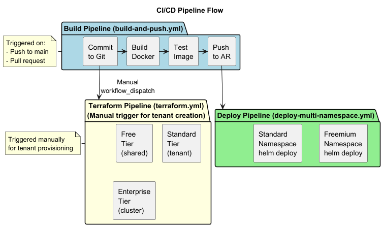

**PlantUML Source:** [diagrams/cicd-pipeline-flow.puml](diagrams/cicd-pipeline-flow.puml)

#### Workflow Files

**Build Workflows (ghcr-and-gcp-*.yml)**

Each microservice has its own build workflow that builds and pushes Docker images:

| Workflow | Service | Trigger |
|----------|---------|---------|
| `ghcr-and-gcp-itinerary.yml` | Itinerary Service | Chart.yaml appVersion change |
| `ghcr-and-gcp-recommendation-service.yml` | Recommendation Service | Chart.yaml appVersion change |
| `ghcr-and-gcp-comments-likes.yml` | Comments & Likes Service | Chart.yaml appVersion change |
| `ghcr-and-gcp-travel-warnings.yml` | Travel Warnings Service | Chart.yaml appVersion change |
| `ghcr-and-gcp-weather-forecast.yml` | Weather Forecast Service | Chart.yaml appVersion change |
| `ghcr-and-gcp-tenant-service.yml` | Tenant Service | Chart.yaml appVersion change |

**Image Registry:** GitHub Container Registry (ghcr.io)
```
ghcr.io/leotschritter/cad-backend/{project-id}/{service-name}:latest
ghcr.io/leotschritter/cad-backend/{project-id}/{service-name}:{version}
```

**Deploy Workflows**

**1. deploy-multi-namespace.yml** - Deploys tenant services
- **Triggers:** After successful image build, manual dispatch
- **Deploys to:** Freemium namespace, Standard tenant namespaces
- **Services:** itinerary-service, recommendation-service, comments-likes-service
- **Uses:** Helm charts with tenant-specific values files

**2. deploy-shared-services.yml** - Deploys shared services
- **Triggers:** Push to main/develop with weather/travel_warnings path changes
- **Deploys to:** `shared` namespace (for Freemium/Standard) or enterprise cluster
- **Services:** weather-forecast-service, travel-warnings-service
- **Supports:** Shared tier (all tenants) and Enterprise tier (dedicated)

**3. terraform.yml** - Infrastructure provisioning
- **Triggers:** Manual workflow_dispatch
- **Actions:** plan, apply, destroy, validate
- **Environments:** free, standard, enterprise
- **Creates:** Identity Platform tenants, Storage buckets, Workload Identity bindings

**4. cleanup-tenant.yml** - Tenant deletion
- **Triggers:** Manual workflow_dispatch
- **Actions:** Removes Kubernetes namespace, Terraform state, Identity Platform tenant

### 4.3 Creation of new Tenants

#### Tenant Creation Process

**Freemium Tenant (Automatic)**
- Users sign up without tenant context
- Authentication at project level (no tenant ID)
- Shared resources in `freemium` namespace
- No manual steps required

**Standard Tenant Creation:**

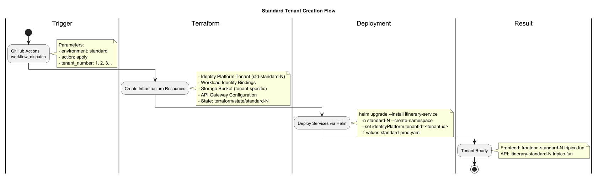

**PlantUML Source:** [diagrams/tenant-creation-standard.puml](diagrams/tenant-creation-standard.puml)

**Enterprise Tenant Creation:**

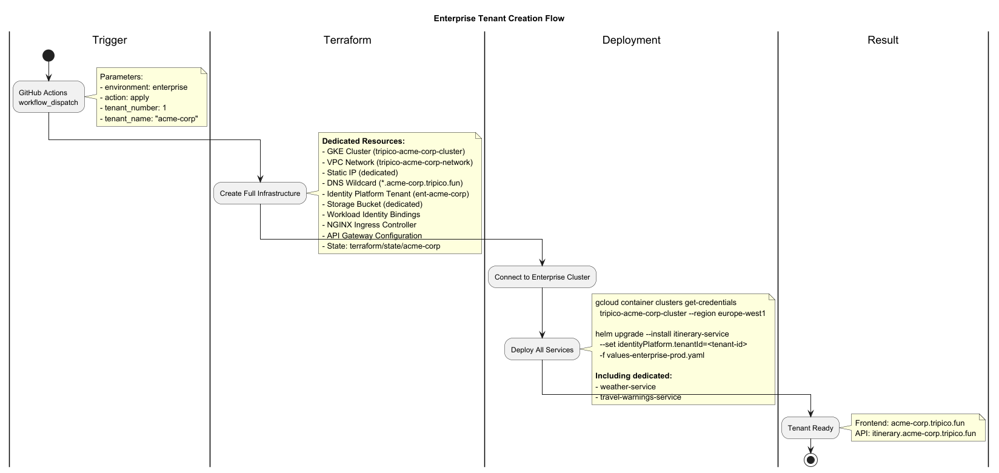

**PlantUML Source:** [diagrams/tenant-creation-enterprise.puml](diagrams/tenant-creation-enterprise.puml)

#### Terraform Workflow Configuration

```yaml
# .github/workflows/terraform.yml
workflow_dispatch:
  inputs:
    action:
      type: choice
      options: [plan, apply, destroy, validate]
    environment:
      type: choice
      options: [free, standard, enterprise]
    tenant_number:
      type: string
      default: '1'
    tenant_name:
      type: string
      description: 'Custom name for enterprise (e.g., acme-corp)'
```

#### Manual Steps Required

| Step | Freemium | Standard | Enterprise |
|------|----------|----------|------------|
| Trigger Terraform | N/A (base infra) | Manual | Manual |
| Deploy Helm Charts | Automatic (CI/CD) | Manual/CI | Manual |
| Configure Frontend | N/A | Update tenant config | Update tenant config |
| DNS Propagation | N/A | Automatic (wildcard) | Automatic (~5 min) |
| Get Tenant ID | N/A | From Terraform output | From Terraform output |

#### Terraform Outputs for Tenant Onboarding

```hcl
# Standard/Enterprise outputs
output "identity_platform_tenant_id" {
  description = "The Identity Platform tenant ID for backend configuration"
  value       = google_identity_platform_tenant.tenant.name
}

output "tenant_subdomain" {
  description = "The subdomain for this tenant"
  value       = local.tenant_subdomain
}

output "api_gateway_url" {
  description = "The API Gateway URL for this tenant"
  value       = module.api_gateway.gateway_url
}
```

### 4.4 Monitoring

#### Health Monitoring

**Kubernetes Health Checks:**

All services implement Quarkus SmallRye Health endpoints:

```yaml
# Deployment health probes
livenessProbe:
  httpGet:
    path: /q/health/live
    port: 8080
  initialDelaySeconds: 30
  periodSeconds: 10

readinessProbe:
  httpGet:
    path: /q/health/ready
    port: 8080
  initialDelaySeconds: 5
  periodSeconds: 5

startupProbe:
  httpGet:
    path: /q/health/started
    port: 8080
  initialDelaySeconds: 10
  periodSeconds: 5
  failureThreshold: 30
```

**GKE Autopilot Built-in Monitoring:**
- Node health automatically managed
- Pod scheduling optimized
- Resource scaling automatic

#### Logging

**Cloud Logging Integration:**

All GKE workloads automatically send logs to Google Cloud Logging:

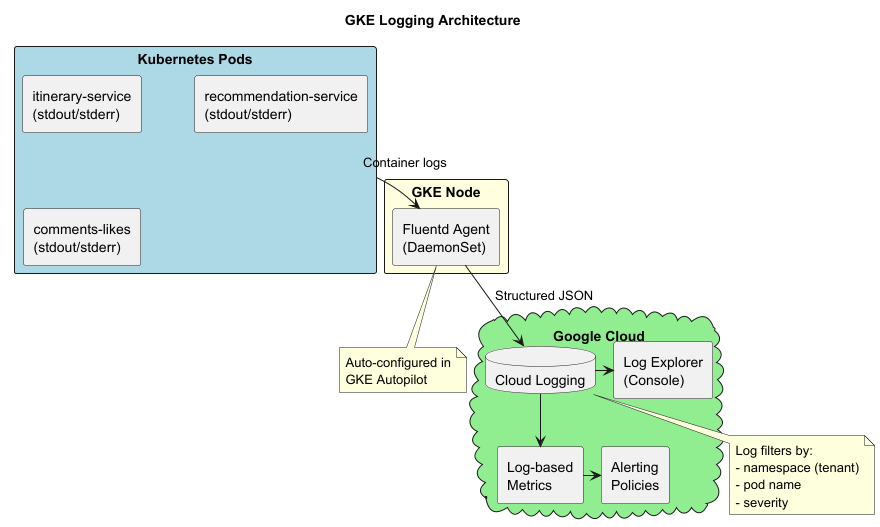

**PlantUML Source:** [diagrams/logging-architecture.puml](diagrams/logging-architecture.puml)

**Log Queries:**

```
# Query logs for specific tenant namespace
resource.type="k8s_container"
resource.labels.namespace_name="standard-1"
resource.labels.container_name="itinerary-service"

# Query error logs across all services
resource.type="k8s_container"
severity>=ERROR

# Query logs for specific user request (trace ID)
resource.type="k8s_container"
jsonPayload.traceId="abc123"
```

**Log Retention:**
- Default: 30 days
- Can be extended via Log Router sinks to Cloud Storage

#### Alerting

**GCP Cloud Monitoring Alerts:**

| Alert | Condition | Action |
|-------|-----------|--------|
| Pod CrashLoopBackOff | Restart count > 5 in 10 min | Email notification |
| High Error Rate | 5xx responses > 5% | Email notification |
| High Latency | P95 > 5s for 5 min | Email notification |
| Node Not Ready | Node unhealthy > 5 min | Auto-remediation (GKE) |

**HPA Scaling Events:**
- Logged automatically in Cloud Logging
- Can trigger alerts on scale-up events

---

## 5 Performance Tests

*Performance tests from Milestone 2 remain applicable. The multi-tenant architecture was tested with the same load testing suite. Key findings:*

### 5.1 Periodic Workload

**Scenario 1: 100 Concurrent Users**
- **Result:** Excellent performance (0.051% failure rate)
- **Avg Response Time:** 244 ms
- **Throughput:** 33 req/s
- **No auto-scaling triggered**

**Scenario 2: 1000 Concurrent Users**
- **Result:** Severe degradation (22.32% failure rate)
- **Root Cause:** Cloud SQL connection pool exhaustion
- **Recommendation:** Upgrade to production-tier Cloud SQL

### 5.2 Once-in-a-Lifetime Workload

**Viral Traffic Simulation (2000 users, gradual ramp):**
- **Breaking Point:** ~900 concurrent users
- **Graceful Degradation:** System survived but with 65s response times
- **Failure Rate:** 0.66% (better than sudden spike)
- **Recommendation:** Implement request queue limits and optimize auto-scaling

---

## 6 Commercial Model

### 6.1 Tenant Types

#### Infrastructure Comparison

All tiers provide **identical application features** (itinerary planning, recommendations, weather forecasts, travel warnings, social interactions). The tier differentiation is based on **infrastructure isolation and resource allocation**:

| Aspect | Freemium | Standard | Enterprise |
|--------|----------|----------|------------|
| **Target** | Individual users | SMBs | Large organizations |
| **Pricing** | Free | EUR x.xx/month | Custom |
| **Cluster** | Shared GKE cluster | Shared GKE cluster | Dedicated GKE cluster |
| **Namespace** | Shared (`freemium`) | Dedicated (`standard-{N}`) | Dedicated (full cluster) |
| **Identity Tenant** | Shared (project-level) | Dedicated (`std-{name}`) | Dedicated (`ent-{name}`) |
| **Subdomain** | `frontend-freemium.tripico.fun` | `frontend-standard-{N}.tripico.fun` | `{company}.tripico.fun` |
| **Weather/Warnings** | Shared services | Shared services | Dedicated instances |
| **Resource Limits** | Minimal | Standard | Custom allocation |
| **VPC/Network** | Shared | Shared | Private rules |

#### Application Features (Same for All Tiers)

| Feature | Description |
|---------|-------------|
| Itinerary Management | Create, read, update itineraries with locations, accommodations, transport |
| Personalized Recommendations | Neo4j graph-based recommendations using collaborative filtering |
| Weather Forecasts | 7-day daily + 24-hour hourly forecasts via Meteosource API |
| Travel Warnings | Real-time warnings from Auswärtiges Amt with email notifications |
| Social Features | Like and comment on itineraries |
| Image Upload | Location images stored in Cloud Storage |

### 6.2 Pricing Model

#### Pricing Tiers

| Tier | Price | Notes |
|------|-------|-------|
| **Freemium** | Free | Shared infrastructure |
| **Standard** | TBD | Dedicated namespace |
| **Enterprise** | Custom | Dedicated cluster, negotiated |

#### Pricing Justification

**Standard Tier (EUR x.xx/month):**
- Dedicated Kubernetes namespace with isolated workloads
- Dedicated Google Identity Platform tenant for user isolation
- Higher Kubernetes resource limits than Freemium

**Enterprise Tier (Custom pricing):**
- Dedicated GKE Autopilot cluster
- Custom subdomain (`{company}.tripico.fun`)
- Dedicated Weather and Travel Warnings service instances
- Private VPC and firewall rules
- Custom resource allocation based on requirements

> **Note:** Usage-based quotas and limits (API calls, storage, etc.) are not currently enforced in the application code. All tiers have equal access to all features.

### 6.3 Cost Model

#### Shared Infrastructure Costs (Monthly)

| Component | Cost (EUR) | Notes |
|-----------|------------|-------|
| GKE Autopilot (shared) | ~150 | 4 nodes base |
| Cloud DNS | ~1 | Zone + queries |
| Artifact Registry | ~20 | Image storage |
| Cloud Firestore | ~25 | Shared database |
| Static IP | ~7 | Shared ingress |
| NGINX Ingress | ~30 | Load balancer |
| Shared Services (weather + warnings) | ~64 | Dedicated pods |
| **Total Shared** | **~297** | |

#### Per-Tenant Costs

**Freemium Namespace:**

| Component              | Cost (EUR) |
|------------------------|------------|
| itinerary-service      | ~9         |
| recommendation-service | ~9         |
| neo4j                  | ~22        |
| comments-likes-service | ~9         |
| postgres               | ~8         |
| **Total**              | **~57**    |

**Standard Namespace:**

| Component              | Cost (EUR) |
|------------------------|------------|
| itinerary-service      | ~9         |
| recommendation-service | ~18        |
| neo4j                  | ~40        |
| comments-likes-service | ~9         |
| postgres               | ~8         |
| **Total**              | **~84**    |

**Enterprise Cluster:**

| Component                | Cost (EUR) |
|--------------------------|------------|
| Dedicated GKE Cluster    | ~73        |
| All services (dedicated) | ~100       |
| Dedicated weather/warnings | ~64      |
| Static IP                | ~7         |
| NGINX Ingress            | ~30        |
| **Total**                | **~274**   |

#### Profitability Scenarios

**Best Case: 10 Freemium + 10 Standard + 3 Enterprise**

| Component              | Cost (EUR) | Revenue (EUR)          |
|------------------------|------------|------------------------|
| Shared Infrastructure  | 297        | -                      |
| 10x Freemium Namespace | 570        | 0                      |
| 10x Standard Namespace | 840        | 1,990                  |
| 3x Enterprise Cluster  | 822        | 2,997                  |
| **Total**              | **2,529**  | **4,987**              |
| **Profit**             |            | **2,458 (49% margin)** |

**Average Case: 20 Freemium + 5 Standard + 1 Enterprise**

| Component              | Cost (EUR) | Revenue (EUR)    |
|------------------------|------------|------------------|
| Shared Infrastructure  | 297        | -                |
| 20x Freemium Namespace | 1,140      | 0                |
| 5x Standard Namespace  | 420        | 995              |
| 1x Enterprise Cluster  | 274        | 999              |
| **Total**              | **2,131**  | **1,994**        |
| **Profit**             |            | **-137 (LOSS)**  |

**Worst Case: 50 Freemium + 2 Standard + 0 Enterprise**

| Component              | Cost (EUR) | Revenue (EUR)      |
|------------------------|------------|--------------------|
| Shared Infrastructure  | 297        | -                  |
| 50x Freemium Namespace | 2,850      | 0                  |
| 2x Standard Namespace  | 168        | 398                |
| **Total**              | **3,315**  | **398**            |
| **Profit**             |            | **-2,917 (LOSS)** |

#### Key Insights

1. **Freemium users are costly** - EUR 57/month each with zero revenue
2. **Break-even requires:** ~3 Standard or ~1 Enterprise tenant to cover shared costs
3. **Enterprise is most profitable:** EUR 725/tenant margin (73%)
4. **Standard margin:** EUR 115/tenant (58%)
5. **Recommendation:** Limit freemium users and focus on conversion to paid tiers

#### Break-Even Analysis

| Metric                                     | Value          |
|--------------------------------------------|----------------|
| Fixed Costs (Shared Infrastructure)        | EUR 297/month  |
| Break-even Standard Tenants                | 3 tenants      |
| Break-even Enterprise Tenants              | 1 tenant       |
| Optimal Freemium:Standard:Enterprise Ratio | 10:5:2         |

---

*Last updated: January 27, 2026*
